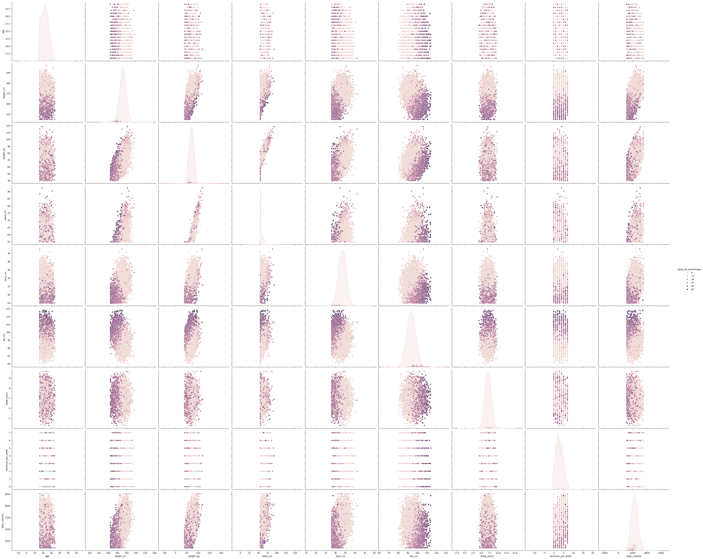

<div align="center">

# 🏋️ AI-Driven Fitness Intelligence System

### An end-to-end Machine Learning application that predicts body fat percentage from physiological & lifestyle data and generates personalised workout plans.

<br>

[](https://ai-driven-fitness-intelligence-systemgit-xt9iwnappfn2qmgudqduc.streamlit.app)

<br>


<br>



</div>

---

## 📌 Table of Contents

- [Overview](#-overview)
- [Live Demo](#-live-demo)
- [Features](#-features)
- [ML Pipeline](#-ml-pipeline)
- [Model Comparison](#-model-comparison--lr-vs-xgboost)
- [Dataset](#-dataset)
- [Tech Stack](#-tech-stack)
- [Project Structure](#-project-structure)
- [Installation](#-installation--setup)
- [Future Improvements](#-future-improvements)
- [Author](#-author)

---

## 🧠 Overview

The **AI-Driven Fitness Intelligence System** is a full-stack machine learning application that combines body composition prediction with personalised fitness planning.

Users enter physiological measurements and lifestyle data — the system predicts their body fat percentage using a trained ML model, categorises their result, and generates a custom workout plan tailored to their goal, activity level, and training environment (home or gym).

The project covers the complete ML lifecycle: data preprocessing, outlier handling, feature engineering, model training, evaluation, comparison, and deployment via an interactive Streamlit web app.

---

## 🚀 Live Demo

<div align="center">

[](https://ai-driven-fitness-intelligence-systemgit-xt9iwnappfn2qmgudqduc.streamlit.app)

</div>

> Enter your age, weight, height, waist, activity level and more — get your predicted body fat % and a personalised weekly workout plan instantly.

---

## ✨ Features

| Feature | Description |
|--------|-------------|
| 🔬 **BF% Prediction** | Predicts body fat percentage from 12 physiological & lifestyle inputs |
| 📊 **Health Categorisation** | Classifies result as Lower / Healthy / Higher / High (gender-aware) |
| 🏠 **Home Workout Plan** | Generates day-wise plans with no-equipment or minimal-equipment options |
| 🏋️ **Gym Workout Plan** | Full gym split (Push/Pull/Legs, Upper/Lower, Full Body) based on weekly frequency |
| 🧭 **4-Step Wizard UI** | Guided flow: Details → Predict → Workout Type → Plan |
| ⚡ **Real-time Prediction** | Instant inference via pre-trained `.pkl` model pipeline |

---

## ⚙️ ML Pipeline

```
Raw Data (5000 rows)
       │
       ▼
┌─────────────────────────┐
│  1. Data Cleaning        │  Normalize text: gender, activity_level, fitness_goal
└────────────┬────────────┘
             │
             ▼
┌─────────────────────────┐
│  2. Outlier Treatment    │  IQR-based capping (winsorization) on all numeric cols
│     (all 9 numeric cols) │  Q1/Q3 computed from data — never hardcoded
└────────────┬────────────┘
             │
             ▼
┌─────────────────────────┐
│  3. Train / Test Split   │  80% train — 20% test  |  random_state=42
└────────────┬────────────┘
             │
             ▼
┌─────────────────────────┐
│  4. Preprocessing        │  OneHotEncoder  → gender, fitness_goal
│     (ColumnTransformer)  │  OrdinalEncoder → activity_level
│                          │  StandardScaler → all numeric features
└────────────┬────────────┘
             │
             ▼
┌─────────────────────────┐
│  5. Model Training       │  Linear Regression  (baseline)
│                          │  XGBoost Regressor  (final model)
└────────────┬────────────┘
             │
             ▼
┌─────────────────────────┐
│  6. Evaluation           │  R² Score, MAE, RMSE
│     + Model Selection    │  Best model auto-saved as .pkl
└────────────┬────────────┘
             │
             ▼
┌─────────────────────────┐
│  7. Deployment           │  Streamlit app  +  Streamlit Cloud
└─────────────────────────┘
```

---

## 📈 Model Comparison — LR vs XGBoost

Two regression models were trained on the same preprocessed data and evaluated on an identical held-out test set.

| Metric | Linear Regression | XGBoost Regressor | Improvement |
|--------|:-----------------:|:-----------------:|:-----------:|
| **R² Score** | 0.9894 | **0.9954** | +0.6% |
| **MAE** | 0.3012% | **0.2141%** | −29% error |
| **RMSE** | 0.4438% | **0.3041%** | −31% error |

### Why XGBoost wins here

Linear Regression assumes body fat percentage is a **straight-line combination** of inputs. In reality, the relationship is non-linear — for example, the same waist measurement means a very different BF% for a 20-year-old vs a 45-year-old, or for a male vs a female.

XGBoost builds **500 sequential decision trees**, where each tree corrects the mistakes of the previous one. This allows it to capture:

- Interactions between features (e.g. gender × waist × age)
- Non-linear thresholds (e.g. "above 90cm waist AND sedentary → high BF%")
- Diminishing returns in features (e.g. extra calories matter less at high intake levels)

```
Linear Regression:
  BF% = 0.5×weight + 0.3×waist + 0.1×age + ...   ← one fixed formula

XGBoost (Round 1 → Round 500):
  Round 1 predicts → error = 2.1%
  Round 2 corrects → error = 0.9%
  Round 3 corrects → error = 0.4%
  ...
  Round 500        → error ≈ 0.21%  ✅
```

**Conclusion:** XGBoost was selected as the production model and saved as `gym_ai_bodyfat_model.pkl`.

---

## 📂 Dataset

The dataset contains **5,000 synthetic records** with the following features:

| Feature | Type | Description |
|---------|------|-------------|
| `age` | Numeric | Age in years |
| `gender` | Categorical | male / female |
| `height_cm` | Numeric | Height in centimetres |
| `weight_kg` | Numeric | Weight in kilograms |
| `waist_cm` | Numeric | Waist circumference |
| `neck_cm` | Numeric | Neck circumference |
| `hip_cm` | Numeric | Hip circumference |
| `sleep_hours` | Numeric | Average nightly sleep |
| `workouts_per_week` | Numeric | Weekly training frequency |
| `daily_calories` | Numeric | Estimated daily calorie intake |
| `activity_level` | Categorical | sedentary / light / moderate / active |
| `fitness_goal` | Categorical | fat_loss / maintain / muscle_gain |
| `body_fat_percentage` | Numeric | **Target variable** |

---

## 🛠️ Tech Stack

| Category | Tools |
|----------|-------|
| **Language** | Python 3.10+ |
| **ML & Data** | Scikit-Learn, XGBoost, NumPy, Pandas |
| **Visualisation** | Matplotlib, Seaborn |
| **Model Persistence** | Joblib |
| **Web App** | Streamlit |
| **Deployment** | Streamlit Cloud |
| **Version Control** | Git, GitHub |

---

## 📁 Project Structure

```
AI-Driven-Fitness-Intelligence-System/
│
├── app.py                        # Streamlit web application
├── start_01.ipynb                # ML notebook (EDA, training, evaluation)
├── gym_ai_bodyfat_model.pkl      # Trained XGBoost pipeline (saved model)
├── fitness_dataset_5000.csv      # Training dataset
├── fitness_report.html           # YData Profiling EDA report
├── output.png                    # App screenshot
├── requirements.txt              # Python dependencies
├── .gitignore
├── LICENSE
└── README.md
```

---

## ▶️ Installation & Setup

**1. Clone the repository**
```bash
git clone https://github.com/parthTyagi-tech/AI-Driven-Fitness-Intelligence-System.git
cd AI-Driven-Fitness-Intelligence-System
```

**2. Install dependencies**
```bash
pip install -r requirements.txt
```

**3. Run the app**
```bash
streamlit run app.py
```

**4. Open in browser**
```
http://localhost:8501
```

> ⚠️ Make sure `gym_ai_bodyfat_model.pkl` and `app.py` are in the **same folder** before running.

---

## 🔮 Future Improvements

- [ ] Replace synthetic dataset with real-world body composition measurements
- [ ] Add AI-based personalised diet and calorie recommendation engine
- [ ] Integrate wearable device data (heart rate, steps, sleep tracking)
- [ ] Add progress tracking — log measurements over time
- [ ] Body fat classification with visual body composition charts
- [ ] REST API layer for mobile app integration

---

## 👨‍💻 Author

**Parth Tyagi**
Machine Learning · Data Science · AI Systems

[](https://github.com/parthTyagi-tech)

---

<div align="center">

⭐ **If you found this project useful, consider starring the repository!**

</div>
